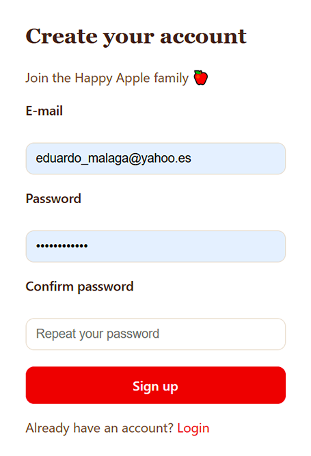
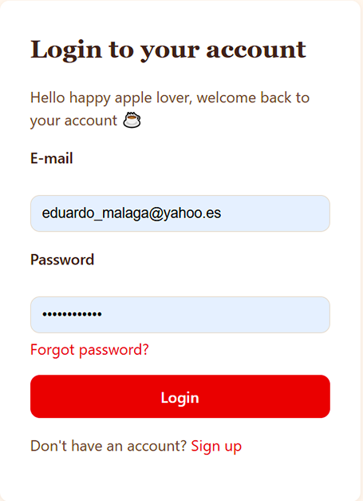
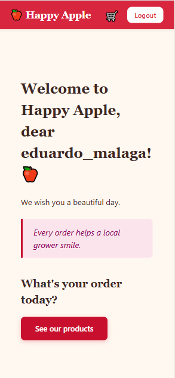
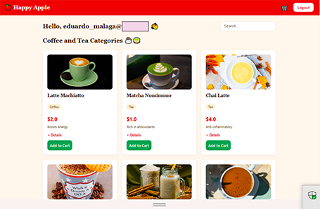
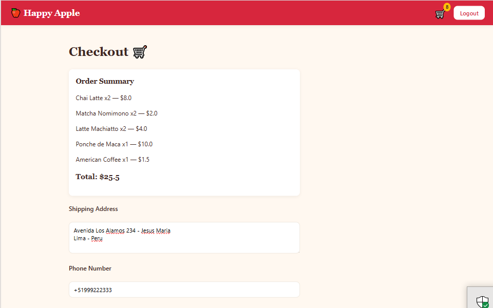
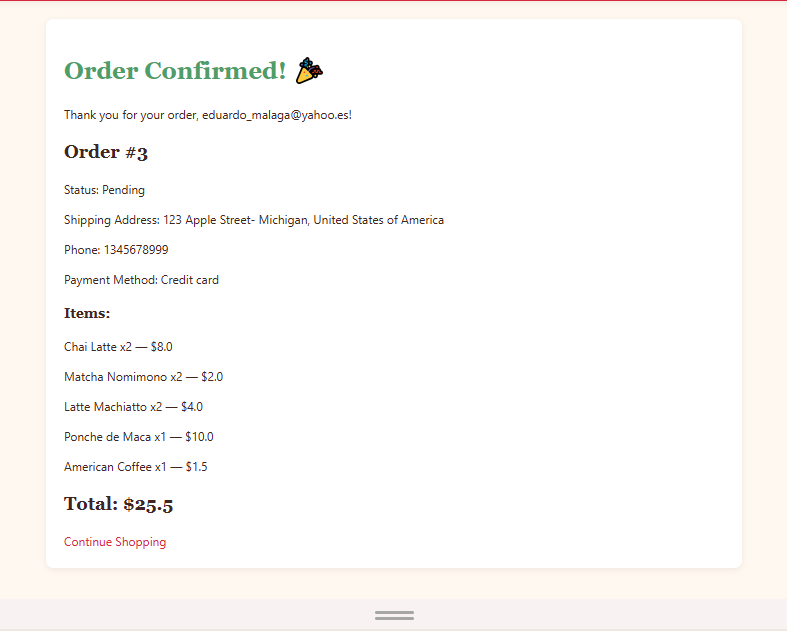
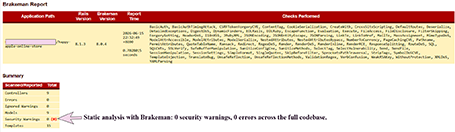
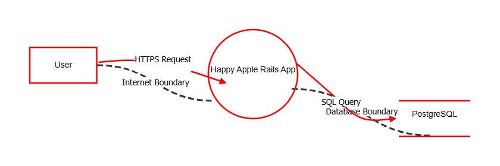

 ##  🍎 Happy Apple Online Store

<strong>A Full-stack e-commerce application </strong> built entirely with Ruby on Rails 8.1, demonstrating a complete purchase flow alongside a deliberate, documented approach to application security.<br/>

This project contains 3 important parts described:
<strong>Functionality </strong>, <strong> Security</strong>, and <strong>Compliance</strong>. 

Live demo: https://happy-apple-online-store-production.up.railway.app

### Part 1 — Functionality

#### Tech Stack

Backend: Ruby on Rails 8.1.3 (monolith).<br/>
Frontend: Server-rendered ERB views + Turbo/Hotwire (Rails-native, no separate JS framework).<br/>
Database: PostgreSQL.<br/>
Authentication: BCrypt (has_secure_password), Rails 8 native session-based auth.<br/>
Testing: RSpec (TDD workflow throughout).<br/>
Static analysis: Brakeman.<br/>
Deployment: Railway.<br/>

#### Features

User registration and login with hashed passwords.<br/>
Personalized dashboard with a rotating "thought of the day".<br/>
Product catalog with categories (coffee/tea), search, and detail view.<br/>
Shopping cart (add, update quantity, remove items).<br/>
Checkout flow with shipping address, phone, and payment method selection.<br/>
Order confirmation and persistent order history per user.<br/>

### Full-Stack E-Commerce Happy Apple Online Store

#### Sign-up Part:
<br/>

#### Login Part:
<br/>

#### Dashboard Part:
<br/>

#### Products Gallery & Description & Prices:
<br/>

#### Checkout-Shipping Part:
<br/>

#### Order-Confirmed Part:
<br/>

#### Testing (TDD)

The project follows a <strong> TDD workflow (red → green → refactor) </strong> for all features and bug fixes.

Run the full suite:<br/>
```
bundle exec rspec
```

<strong>Test coverage includes:</strong>

- Model specs (validations, callbacks, normalization logic).<br/>
- Request specs (authentication flows, authorization/IDOR checks, CRUD endpoints).<br/>
- Helper specs (dashboard "thought of the day" rotation).<br/><br/>

<strong>Local Setup</strong>

git clone https://github.com/IvonneBenitesRodriguez/happy-apple-online-store.git <br/>
cd happy-apple-online-store <br/>
bundle install <br/>
bin/rails db:create db:migrate db:seed <br/>
bin/rails server <br/>

<strong>Hint:</strong><br/>
Visit http://localhost:3000 <br/>

<strong>Deployment</strong> 

Deployed on Railway with a managed PostgreSQL instance.

DATABASE_URL is provided automatically by Railway's Postgres plugin and consumed via config/database.yml.<br/>

RAILS_MASTER_KEY and RAILS_ENV=production are set as service environment variables. <br/>

Production uses config.cache_store = :memory_store and config.active_job.queue_adapter = :async to avoid requiring separate Solid Cache/Queue/Cable databases on a single-instance deployment.<br/>

### Part 2 — Security
Security was treated as a first-class requirement throughout development, not an afterthought.<br/> 
Every security control below was implemented following a test-driven approach and is backed by either an automated spec or the Brakeman static analysis report.<br/>

1. <strong>Authentication & Session Management</strong> 🔐

Passwords hashed with <strong>BCrypt</strong> via has_secure_password; no plaintext password is ever stored or logged.
Session-based authentication using Rails 8's built-in Authentication concern, with signed, HTTP-only session cookies.
```
class User < ApplicationRecord
  has_secure_password
  has_many :sessions, dependent: :destroy
  has_one :cart, dependent: :destroy
  has_many :orders, dependent: :destroy
  ...
end
```
And <br/>

```
create_table "users", force: :cascade do |t|
    t.datetime "created_at", null: false
    t.string "email_address", null: false
    t.string "password_digest", null: false
    t.datetime "updated_at", null: false
    t.index ["email_address"], name:"index_users_on_email_address", unique: true
  end
```
2. <strong>Access Control — IDOR Protection </strong> ⚠️

OrdersController#show scopes lookups through current_user.orders.find(params[:id]) rather than a global Order.find, <strong>so a user can never load another user's order by guessing or incrementing an ID.</strong>

```
def show
  @order = current_user.orders.find(params[:id])
end
```

Verified with automated request specs: a logged-in user attempting to view another user's order receives a <strong>404 Not Found </strong>, and the response body is asserted not to contain the other user's shipping address (no information leakage even on edge cases).

3. <strong> Mass Assignment / Tampering Protection </strong> 🦹

All controller actions use Rails strong parameters, so an attacker cannot inject unauthorized fields (like `total` or `status`) through the request:

```ruby
def order_params
  params.require(:order).permit(:shipping_address, :phone, :payment_method)
end
```
Order totals are always calculated server-side from product.price, never trusted from client input — preventing price tampering at checkout.<br/>


4. <strong> CSRF & XSS </strong> 💉

- Rails' default CSRF protection is enabled on all state-changing requests — each form includes a unique authenticity token, verified server-side, preventing forged cross-site requests from acting on behalf of a logged-in user.
- ERB views escape output by default. A repository-wide search confirmed **zero occurrences** of `raw` or `html_safe` on user-supplied content:

```powershell
Get-ChildItem -Path app/views -Recurse -Include *.erb | Select-String -Pattern "raw|html_safe"
# No matches found
```

6.<strong> Static Analysis — Brakeman </strong>🧑‍💻

Brakeman was run against the full codebase (9 controllers, 9 models, 15 templates) covering ~120 vulnerability categories including SQL Injection, XSS, Mass Assignment, Session Manipulation, and CSRF.

Result: 0 security warnings, 0 errors.<br/>


7. <strong> Transport Security</strong> 🌐

config.force_ssl = true and config.assume_ssl = true enabled in production, enforcing HTTPS for all traffic. <br/>

Also included in the Security section: <br/>

### Threat Modeling — OWASP Threat Dragon (STRIDE) 🐉

Beyond ad-hoc security reviews, this project includes a formal STRIDE threat model built with OWASP Threat Dragon, mapping trust boundaries between the user, the Rails application, and the PostgreSQL database.



18 threats were identified across STRIDE categories (Spoofing, Tampering, Repudiation, Information Disclosure, Denial of Service, Elevation of Privilege), mapped per element type and cross-checked against the actual codebase rather than assumed.<br/><br/>
11 threats are currently mitigated and verified (e.g., SQL Injection via parameterized ActiveRecord queries, IDOR via current_user-scoped lookups, login brute-force via Rails 8's native `rate_limit`); 7 remain open and tracked as next steps below. <br/>

The full model — including descriptions, mitigations, and status per threat — is available in [`ThreatDragonModels/Happy Apple Online Store/Happy Apple Online Store.json`](ThreatDragonModels/Happy%20Apple%20Online%20Store/Happy%20Apple%20Online%20Store.json).


### Part 3. Compliance 📋

**GDPR**
- Lawful basis for processing: contract performance (data is needed to fulfill a purchase).
- Data minimization: only email, shipping address, phone, and order history are collected — nothing beyond what checkout requires.
- Access control: personal data is only retrievable by its owner via `current_user`-scoped queries (see IDOR protection above).
- Password security: passwords are hashed with BCrypt and never stored or transmitted in plaintext.
- **Known limitation — Right to Erasure (Art. 17):** no self-service account deletion yet.
- **Known limitation — Right of Access (Art. 15):** no self-service data export yet.

**PCI-DSS**
- No real payment gateway is integrated yet; `payment_method` is currently a placeholder field for demonstration purposes. The architecture is intentionally designed so that, if integrated, cardholder data would never touch this application's servers or database — keeping it in the lowest validation tier (SAQ A).


